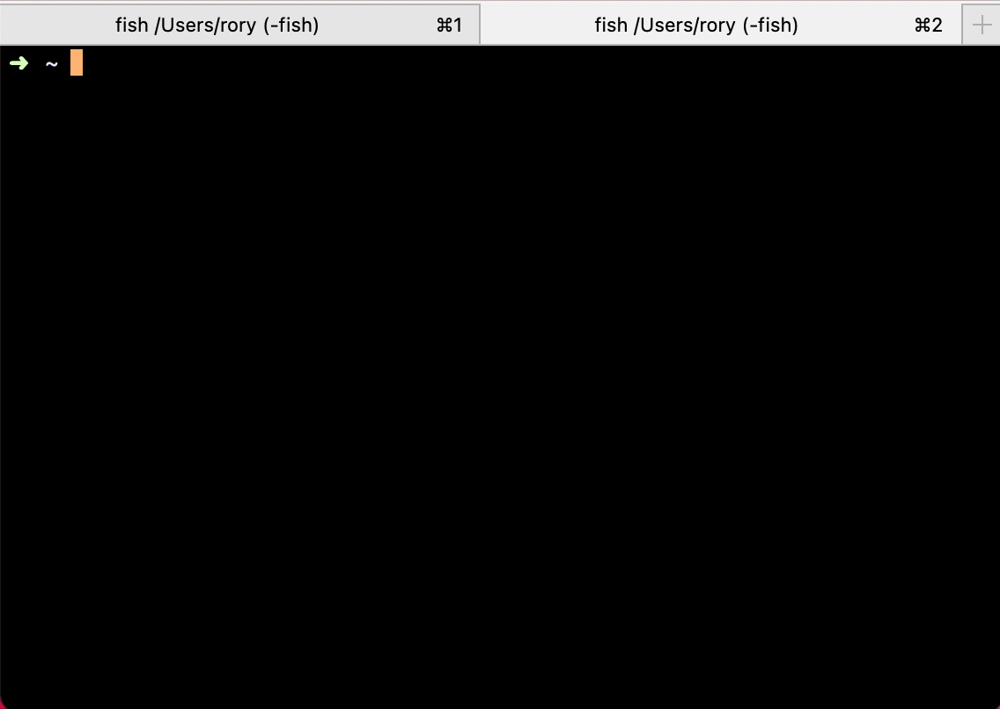

# Synesthesia
### Sense your projects as terminal colours

Synesthesia updates your terminal tab and background colours depending on the go module name in your directory ancestry.

- **iTerm2**: Automatically updates the tab colour.
- **Ghostty & Others**: Lightly tints the terminal background (enabled by default).

If you use git worktrees (or jj workspaces), then each copy of the same project will have a different but consistent colour.

# Installation
### 1. Install from source using golang 1.25

```bash
go install github.com/roryq/synesthesia@latest
```

### 2. Configure a hook for your shell

#### fish
Add the following line to your `~/.config/fish/config.fish`:
```fish
synesthesia hook fish | source
```

#### zsh
Add the following line to your `~/.zshrc`:
```zsh
eval "$(synesthesia hook zsh)"
```

# Usage
Navigate between your directories as usual. When you have multiple tabs open for different projects, 
a consistent random colour will be chosen for any tabs with the same project name.

### Sense Custom Text
You can sense a colour for any custom string (useful for agent names or specific project labels):
```bash
synesthesia sense "my-project-label"
```

### Background Tinting
Background tinting is enabled by default. To disable it, use the `--no-background-tint` flag:
```bash
synesthesia --no-background-tint
```

To generate a hook with tinting disabled:
```bash
synesthesia hook zsh --no-background-tint
```



# License
[MIT](LICENSE)
